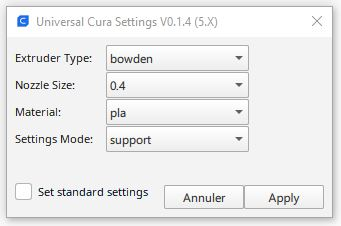

# Universal Cura Settings
 
Universal Cura Settings. 12 types of adjustment to define recommended settings for your current Cura configuration.
 
* standard
* bed adhesion
* warping
* top surface
* extra quality
* mechanical
* small part
* figurine
* prototype
* support
* vase
* save material

Standard		(general recommended settings)

Bed adhesion	(first layer settings for a better bed adhesion)

Warping			(increase the first layer adhesoin and avoid nozzle collision with Z hop settings )

Top surface		(increase the quality on top surface by using mainly Ironing options)

Extra Quality	(increase the quality of the print skin)

Small part		(use of a raft adhesion solution to get a better bed adhesion)

Mechanical		(dimensionally accurate, stiff and durable)

Figurine		(fine details and good cooling)

Prototype		(fast and rought result)

Support			(easy support remove)

Vase			(spiralize outer contour)

Save material	(use the minimum material)

## How to use It

Select the type of settings you want to apply to your current Cura configuration

- Extruder type   : Bowden or direct drive
- The Nozzle Size : 0.2 0.4 0.6 0.8 1.0
- The Material    : PLA, ABS, PETG, TPU
- The type of Intent  :

  - [standard](https://github.com/5axes/UniversalCuraSettings/discussions/12)
       
  - [bed adhesion](https://github.com/5axes/UniversalCuraSettings/discussions/9) 
        
  - [warping](https://github.com/5axes/UniversalCuraSettings/discussions/13)

  - [top surface](https://github.com/5axes/UniversalCuraSettings/discussions/17)
  
  - [extra quality](https://github.com/5axes/UniversalCuraSettings/discussions/31)
        
  - [mechanical](https://github.com/5axes/UniversalCuraSettings/discussions/8)
 
  - [small part](https://github.com/5axes/UniversalCuraSettings/discussions/18)
  
  - [figurine](https://github.com/5axes/UniversalCuraSettings/discussions/14)
        
  - [prototype](https://github.com/5axes/UniversalCuraSettings/discussions/10)

  - [support](https://github.com/5axes/UniversalCuraSettings/discussions/22)
        
  - [vase](https://github.com/5axes/UniversalCuraSettings/discussions/15)
 
  - [save material](https://github.com/5axes/UniversalCuraSettings/discussions/27) 
  
  

Press the Button **APPLY** to modify your current configuration according to your choice. A message wil be display at the end of the modification with the number of modified parameters.

## Why is it call Universal Cura Settings

Initial settings comes from some profiles released by **Jonas Idebrant** aka [printingotb](https://github.com/printingotb) on the Cura Facebook Group. The main idea was to publish an Universal Cura Settings profile based on his own printing experience. I had for a long time the idea to create a plugin which was able to set some standard parameters instead of always use some profile. When we merge the two ideas you got this UniversalCuraSettings plugin. 

**Note : It's still a "Concept" use it carrefuly.**
