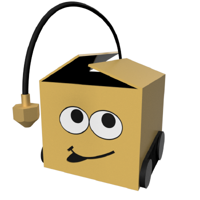

# JonasUniversalCuraSettings
 
 Jonas Universal Cura Settings. 5 Profiles to define recommended settings on your current Cura configuration.
 
- mechanical
- bed adhesion
- figurine
- prototype
- vases

Mechanical (dimensionally accurate, stiff and durable)

Figurine (fine details and good cooling)

Bed adhesion (first layer settings for a better bed adhesion)

Prototype (fast and rought result)

Vases (spiralize outer contour)

## How to use It

Select the type of settings you want to apply to your current Cura configuration

- Extruder type : Bowden or direct drive
- The Nozzle Size : 0.2 0.4 0.6 0.8
- The Material :  PLA, ABS PETG
- The type of Intent  :
        - mechanical
        - bed adhesion
        - figurine
        - prototype
        - vases

Press the Button **APPLY** to modify your current configuration according to your choice. A message wil be display at the end of the modification with the number of modified parameters.

## Why is it call Jonas Universal Cura Settings

Initial settings comes from some profiles released by **Jonas Idebrant** aka [printingotb](https://github.com/printingotb) on the Cura Facebook group. The main idea was to publish an Universal Cura Settings profile based on his own printing experience. I had for a long time the idea to create a plugin which was able to set some standard parameters instead of always use some profile. when we merge the two ideas you got this JonasUniversalCuraSettings plugin. 

Note : It's still a "Concept" use it carrefuly.
