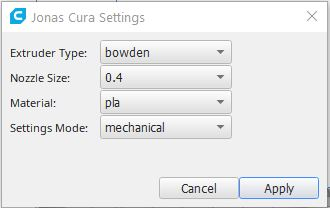

# JonasUniversalCuraSettings
 Jonas Universal Cura Settings
 
 
 5 Profiles to define recommended settings
 
- mechanical
- bed adhesion
- figurine
- prototype
- vases

Mechanical (dimensionally accurate, stiff and durable)

Figurine (fine details and good cooling)

Bed adhesion (first layer settings for a better bed adhesion)

Prototype (fast and rought result)

Vases (spiralize outer contour)

How to use It

Select the type of settings you want to apply to your current Cura configuration

- Extruder type : Bowden or direct drive
- The Nozzle Size : 0.2 0.4 0.6 0.8
- The Material :  PLA, ABS PETG
- The type of Intent  :
        - mechanical
        - bed adhesion
        - figurine
        - prototype
        - vases
